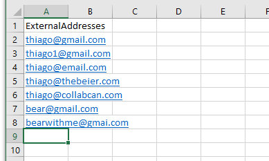

**ADDS - Creating Contacts in Active Directory from CSV**

Hi there

This script is will create contacts in Active Directory from CSV with prefix
avoiding duplicate entries when we have info\@gmail.com and info\@yahoo.com
where Name / Display name should be "info" under your Contacts OU.

To avoid that we have the following script

-   **Prefix** : "CA-Contact-"

-   **Contact name / displayname** : \$contactname = "CA-Contact-" + \$name +
    "_" + \$domainname

-   OUPath: I'm using
    "OU=ExternalContact,OU=NotesMigration,DC=thebeier,DC=local" , replace by
    yours or define OUPath as variable \$OUPath =
    "OU=ExternalContact,OU=NotesMigration,DC=thebeier,DC=local" then you use
    only \$OUPath at the new-adobject cmdlet 

\#\#\#\#\#\#\#\#\#\#\#\#\#\#\#\#\#\#\#\#\#\#\#\#\#\#\#\#\#\#\#\#\#\#\#\#\#\#\#\#\#\#\#\#\#\#\#\#\#\#\#\#\#\#\#\#\#\#\#\#\#\#\#\#\#\#\#\#\#\#\#\#\#\#\#\#\#\#\#\#\#\#\#\#\#\#\#\#\#\#\#\#\#\#\#\#\#\#\#\#\#\#\#\#\#\#\#\#\#\#\#\#\#\#\#\#\#\#\#\#\#\#\#\#\#\#\#\#\#\#\#\#\#\#\#\#\#\#\#\#\#\#\#\#\#\#\#\#\#\#\#\#\#\#\#\#\#\#\#\#\#\#\#\#\#\#\#\#\#\#\#\#\#\#\#\#\#\#\#\#\#\#\#\#\#\#\#\#\#\#\#\#\#\#\#\#\#\#\#\#\#\#\#\#\#\#\#\#\#\#\#\#\#\#\#\#\#\#\#\#\#\#\#\#\#\#\#\#\#\#\#\#\#\#\#\#\#\#\#

\# Author Thiago Beier thiago.beier\@gmail.com

\# Version: 1.0 - 2020-07-16

\#

\# Create Contacts in ADDS from a CSV file

\# All duplicates entries where Name or Dipslayname would case issues based on
email-address is handled by this script

\# If a user is info\@multipledomains.com , the Name , Displayname hill have the
following format:

\# Prefix + address + "_" (underline) + domainname without "\@" and no suffix
.com .org whatever

\#

\# Toronto, CANADA

\# Email: thiago.beier\@gmail.com

\# https://www.linkedin.com/in/tbeier/

\# https://twitter.com/thiagobeier

\# https://thiagobeier.wordpress.com

\#\#\#\#\#\#\#\#\#\#\#\#\#\#\#\#\#\#\#\#\#\#\#\#\#\#\#\#\#\#\#\#\#\#\#\#\#\#\#\#\#\#\#\#\#\#\#\#\#\#\#\#\#\#\#\#\#\#\#\#\#\#\#\#\#\#\#\#\#\#\#\#\#\#\#\#\#\#\#\#\#\#\#\#\#\#\#\#\#\#\#\#\#\#\#\#\#\#\#\#\#\#\#\#\#\#\#\#\#\#\#\#\#\#\#\#\#\#\#\#\#\#\#\#\#\#\#\#\#\#\#\#\#\#\#\#\#\#\#\#\#\#\#\#\#\#\#\#\#\#\#\#\#\#\#\#\#\#\#\#\#\#\#\#\#\#\#\#\#\#\#\#\#\#\#\#\#\#\#\#\#\#\#\#\#\#\#\#\#\#\#\#\#\#\#\#\#\#\#\#\#\#\#\#\#\#\#\#\#\#\#\#\#\#\#\#\#\#\#\#\#\#\#\#\#\#\#\#\#\#\#\#\#\#\#\#\#\#\#

clear

\$dt=get-date -format yyyy-MM-dd-hhmm

Start-Transcript log-\$dt.txt

\$file = import-csv .\\external-contacts.csv

foreach (\$line in \$file ){

\$chararray = \$line.ExternalAddresses.Split("\@")

\$name = \$chararray[0]

\$domainname = \$chararray[1]

\$name

\$line

\$email = \$line

\$chararray[1]

\$domain = \$chararray[1].Split(".")

\$domain[0]

\$email = \$line.ExternalAddresses

write-host "CA-Contact-"

\$name

\$domainname

\$contactname = "CA-Contact-" + \$name + "_" + \$domainname

\$contactname

New-ADObject -Name "\$contactname" -DisplayName "\$contactname" -Type "contact"
-Path "OU=ExternalContact,OU=NotesMigration,DC=thebeier,DC=local"
-OtherAttributes \@{'mail'="\$email"}

}

stop-transcript

CSV file

All users are synchronized to Azure AD

Regards,

**Thiago
Beier** [https://thiagobeier.wordpress.com](https://thiagobeier.wordpress.com/)

**Copyright © 2020 Thiago Beier Blog**
