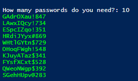

Generate Random Password (ADDS & Azure AD / Office365)

Hi again,  
This powershell script runs on Powershell and Powershell ISE.  
It generates as much as passwords you request by answering the question.  
Tested with Local AD (ADDS) and Azure AD & Office 365.  
Script asks for how many passwords do you need.  
Enter the amount of password to be generated.

The result is shown on screen and on grid view as well.

 

**PowerShell**

\#\#\#\#\#\#\#\#\#\#\#\#\#\#\#\#\#\#\#\#\#\#\#\#\#\#\#\#\#\#\#\#\#\#\#\#\#\#\#\#\#\#\#\#\#\#\#\#\#\#\#\#\#\#\#\#\#\#\#\#\#\#\#\#\#\#\#\#\#\#\#\#\#\#\#\#\#\#\#\#   

\#Author Thiago Beier thiago.beier\@gmail.com   

\#Version: 1.0 - 2019-05-30  

\#Ask for how many password you need and generates all of them on screen 

\#Toronto,CANADA   

\#email: thiago.beier\@gmail.com 

\#https://www.linkedin.com/in/tbeier/ 

\#\#\#\#\#\#\#\#\#\#\#\#\#\#\#\#\#\#\#\#\#\#\#\#\#\#\#\#\#\#\#\#\#\#\#\#\#\#\#\#\#\#\#\#\#\#\#\#\#\#\#\#\#\#\#\#\#\#\#\#\#\#\#\#\#\#\#\#\#\#\#\#\#\#\#\#\#\#\#\#  

 

\$sum = **read-host** "How many passwords do you need?" 

\$a = 1 

\$result = \@() 

 

**while**(\$a -le \$sum) 

{ 

\$global:DefaultPassword =  (-join(65,66,67,68,69,70,71,72,73,74,75,76,77,78,79,80,81,82,83,84,85,86,87,88,89,90\|%{[char]\$_}\|Get-Random -C 2)) + (-join(97,98,99,100,101,102,103,104,105,106,107,108,109,110,111,112,113,114,115,116,117,118,119,120,121,122\|%{[char]\$_}\|Get-Random -C 2)) + (-join(65,66,67,68,69,70,71,72,73,74,75,76,77,78,79,80,81,82,83,84,85,86,87,88,89,90\|%{[char]\$_}\|Get-Random -C 2)) + (-join(97,98,99,100,101,102,103,104,105,106,107,108,109,110,111,112,113,114,115,116,117,118,119,120,121,122\|%{[char]\$_}\|Get-Random -C 2)) + (-join(64,33,35,36\|%{[char]\$_}\|Get-Random -C 1))  + (-join(49,50,51,52,53,54,55,56,57\|%{[char]\$_}\|Get-Random -C 3)) 

\$result +=, \$showpassword = \$global:DefaultPassword 

\#write-host \$showpassword -ForegroundColor Green  

\$a++ 

}  

 

\$result  

\$result \| Out-GridView 

 
